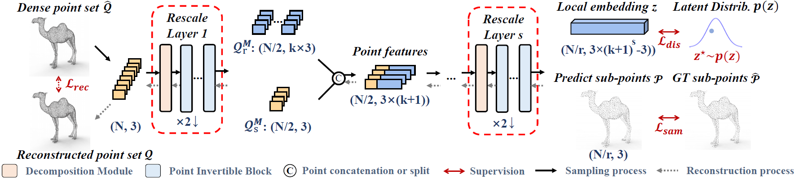

# PointLIE

This repository is for **PointLIE** introduced in the following paper

Weibing Zhao#, [Xu Yan#](https://github.com/yanx27), Jiantao Gao, Ruimao Zhang, Jiayan Zhang, [Zhen Li*](https://mypage.cuhk.edu.cn/academics/lizhen/), Song Wu, Shuguang Cui, "PointLIE: Locally Invertible Embedding for Point Cloud Sampling and Recovery", IJCAI 2021 [[arxiv]](https://arxiv.org/pdf/2104.14769.pdf).
 


If you find our work useful in your research, please consider citing:
```
@misc{zhao2021pointlie,
      title={PointLIE: Locally Invertible Embedding for Point Cloud Sampling and Recovery}, 
      author={Weibing Zhao and Xu Yan and Jiantao Gao and Ruimao Zhang and Jiayan Zhang and Zhen Li and Song Wu and Shuguang Cui},
      year={2021},
      eprint={2104.14769},
      archivePrefix={arXiv},
      primaryClass={cs.CV}
}
```

The code will be released soon...
